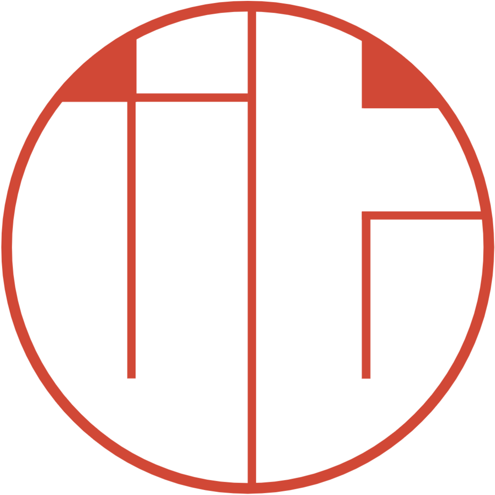

<a name="readme-top"></a>

<!-- PROJECT LOGO -->
<br />
<div align="center">
  <a href="">
    
  </a>

  <h3 align="center">My Portfolio Website</h3>

  <p align="center">
    My portfolio website, showcasing my past experience and best projects.
    <br />
    <br />
    <a href="https://joethompson.co.uk"><strong>View Portfolio Website »</strong></a>
    <br />
    <br />
  </p>
</div>


<!-- ABOUT THE PROJECT -->
## About The Project

[![Homepage][product-screenshot]](https://joethompson.co.uk)

After years of building projects with friends and on my own I thought it was a good time to start collating them
into one website where my work can be easily found, viewed and potentially shared.

Whats included in my portfolio website?
* Projects overview page showing detailed description of my main projects along with images.
* Experience section with an overview into who I've worked for, hackathons I've attended and languages I am familiar with. 


As I continue my computer science journey I will continously add to my portfolio in order for it to stay up to date.

<p align="right">(<a href="#readme-top">back to top</a>)</p>


### Built With

The technologies I used to build my portfolio are listed below:

* [![Vue][Vue.js]][Vue-url]
* [![NPM][NPM]][NPM-url]

<p align="right">(<a href="#readme-top">back to top</a>)</p>


<!-- GETTING STARTED -->
## Getting Started

If you wish to set up the project locally then follow these simple steps below.

### Prerequisites

If npm is already installed on your machine then you can skip this step.
If you don't have npm installed then copy and past the line below into terminal.

* npm
  ```sh
  npm install -g npm
  ```

### Installation

Follow the steps below to set up and start the project locally:

1. Clone the repo
   ```sh
   git clone https://github.com/joethompson1/joethompson.git
   ```
2. Install NPM packages
   ```sh
   npm install
   ```
3. Start the development server
   ```sh
   npm run dev
   ```
4. Open the website locally in your browser
   ```
   http://localhost:3000/
   ```

<p align="right">(<a href="#readme-top">back to top</a>)</p>


<!-- CONTACT -->
## Contact

Joe Thompson 

Email: joe.cl.thompson@gmail.com

Github Link: [https://github.com/joethompson1/joethompson](https://github.com/joethompson1/joethompson)

Project Link: [https://joethompson.co.uk](https://joethompson.co.uk)

<p align="right">(<a href="#readme-top">back to top</a>)</p>


<!-- MARKDOWN LINKS & IMAGES -->
[product-screenshot]: src/assets/screenshotHomepage.png
[NPM]: https://img.shields.io/badge/NPM-d90166?style=for-the-badge&logo=npm&logoColor=white
[NPM-url]: https://www.npmjs.com/
[Next.js]: https://img.shields.io/badge/next.js-000000?style=for-the-badge&logo=nextdotjs&logoColor=white
[Next-url]: https://nextjs.org/
[React.js]: https://img.shields.io/badge/React-20232A?style=for-the-badge&logo=react&logoColor=61DAFB
[React-url]: https://reactjs.org/
[Vue.js]: https://img.shields.io/badge/Vue.js-35495E?style=for-the-badge&logo=vuedotjs&logoColor=4FC08D
[Vue-url]: https://vuejs.org/
[Angular.io]: https://img.shields.io/badge/Angular-DD0031?style=for-the-badge&logo=angular&logoColor=white
[Angular-url]: https://angular.io/
[Svelte.dev]: https://img.shields.io/badge/Svelte-4A4A55?style=for-the-badge&logo=svelte&logoColor=FF3E00
[Svelte-url]: https://svelte.dev/
[Laravel.com]: https://img.shields.io/badge/Laravel-FF2D20?style=for-the-badge&logo=laravel&logoColor=white
[Laravel-url]: https://laravel.com
[Bootstrap.com]: https://img.shields.io/badge/Bootstrap-563D7C?style=for-the-badge&logo=bootstrap&logoColor=white
[Bootstrap-url]: https://getbootstrap.com
[JQuery.com]: https://img.shields.io/badge/jQuery-0769AD?style=for-the-badge&logo=jquery&logoColor=white
[JQuery-url]: https://jquery.com 